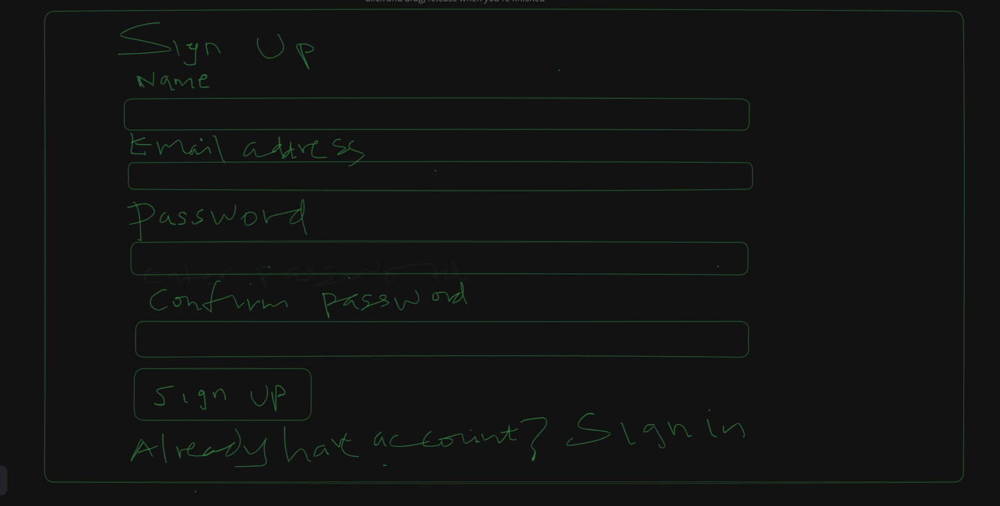

# Project Title

ElectroMart

## Overview

ElectroMart is an ecommerce website where you find all types of modern and latest gadgets like earphones, speakers, digital watches and mobile phones and more!

### Problem Space

In today's fast-paced world, finding the right electronics at the best prices can be a daunting task. Consumers often have to navigate through multiple websites, compare prices, read reviews, and ensure the authenticity of the products before finalizing a purchase. This process is time-consuming and can be overwhelming especially for those looking for specific electronics like mobile phones, headphones,earphones, speakers, and smart watches.
ElectroMart aims to simplify this process by providing a one-stop e-commerce platform focused exclusively on high-quality electronics. This platform will offer a curated selection of products, detailed reviews, and competitive pricing, ensuring that customers can make informed decisions quickly and confidently. By streamlining the shopping experience, ElectroMart will save consumers time and effort, making it easier to find and purchase the electronics they need.

### User Profile

Electronics enthusiasts:
-Exploring latest gadgets , to read detailed product information, and give reviews
-Searching for best deals and discounts,compare prices, and look for sales
-Purchasing electronics for personal use or gifts relying on user-friendly navigation and customer reviews
-Making quick purchases relying on curated selection and effecient checkout processes

### Features

As a user , I want to be able to create account to manage my cart items and checkout processes
As a user , I want to be able to login into my account to manage my cart items and checkout processes
As a user , I want to be able to browse through varieties of products to find the product I need
As a user , I want to be able to search for specific product using keyword to find the product I am looking for
As a user , I want to be able to view detailed product descriptions, specifications, and high- quality images to make informed decisions
As a user , I want to be able to read customer reviews and ratings to understand the quality and performance of the products
As a user , I want to be able to add items in the shopping cart for future purchase
As a user , I want to be able to have secure and streamlined checkout process to complete my purchases effeciently

## Implementation

### Tech Stack

Language: Javascript,
Runtime Envronment: Node.js
Frontend-build tool: Vite

Client Libraries:

- React
- React-router-dom
- Axios

Server Libraries

- Knex / Mongoose
- MySQL / MongoDB
- Express
- bcrypt for password hashing

### APIs

PAYPAL API will use for payment gateway

### Sitemap

- Home page (Featured Products)
- List products
- View product details
- View cart items
- Register
- Login

### Mockups

#### Home Page


#### Register Page



#### Login Page


#### Product Details Page


#### Cart Items Page


### Data


### Endpoints

**GET /products**

- Get products to visitors

Parameters:

Response:

```
[
    {
        "id": 1,
        "title": "Iphone mobile",
        "price": 25.50,
        "rating": 4.5,
        "category":"mobile"
        "created_At":1973334232
    },
    ...
]
```

**GET /products/:id**

- Get product by id whether the user is logged in or not

Parameters:

- id: product id as number

Response:

```
{
    "id": 1,
    "title": "iphone mobile",
    "price": 239.56,
    "rating": 4.5,
    "category":"mobile"
}
```

**POST /products/:id/rating**

- Logged in user can add their rating of a product

Parameters:

- id: product id
- token: JWT of the logged in user
- rating: Number Rating out of 5 in 0.5 increments

Response:

```
{
    "id": 1,
    "title": "iphone mobile",
    "price": $25.98,
    "rating": 4.5,
    ,,
}
```

**PUT /products/:id/rating**

- Logged in user can update their rating of a products

Parameters:

- id: product id
- token: JWT of the logged in user
- rating: Number Rating out of 5 in 0.5 increments

Response:

```
{
    "id": 1,
    "title": "iphone moblie",
    "price": 25.5,
    "rating": 4.5,
}
```

**POST /users/register**

- Add a user account

Parameters:

- email: User's email
- password: User's provided password

Response:

```
{
    "token": "seyJhbGciOiJIUzI1NiIsInR5cCI6IkpXVCJ9.eyJzdWIiOiIxMjM0NTY3ODkwIiwibmFtZSI6I..."
}
```

**POST /users/login**

- Login a user

Parameters:

- email: User's email
- password: User's provided password

Response:

```
{
    "token": ""
}
```

### Auth

- JWT auth
  - Before adding auth, all API requests will be using a fake user with id 1
  - Added after core features have first been implemented
  - Store JWT in localStorage, remove when a user logs out
  - Add states for logged in showing different UI in places listed in mockups

## Roadmap

- Create client

  - react project with routes and boilerplate pages

- Create server

  - express project with routing, with placeholder 200 responses

- Create migrations

- Gather atleast 15 sample electronics products

- Create seeds with sample products data

- Deploy client and server projects so all commits will be reflected in production

- Feature: List products

  - Implement list products page
  - Create GET /products endpoint

- Feature: View Product

  - Implement view product page
  - Create GET /products/:id

- Feature: Rate product

  - Add form input to review product page
  - Create POST /ratings
  - States for add & update ratings

- Feature: Home page

- Feature: Create account

  - Implement register page + form
  - Create POST /users/register endpoint

- Feature: Login

  - Implement login page + form
  - Create POST /users/login endpoint

- Feature: Implement JWT tokens

  - Server: Update expected requests / responses on protected endpoints
  - Client: Store JWT in local storage, include JWT on axios calls

- Bug fixes

- DEMO DAY

---

## Future Implementations

- Integrate PAYPAL for payment gateway
  - View the checkout steps
- Forgot password functionality
- Ability to add, edit and delete a product
- Unit and Integration Tests
