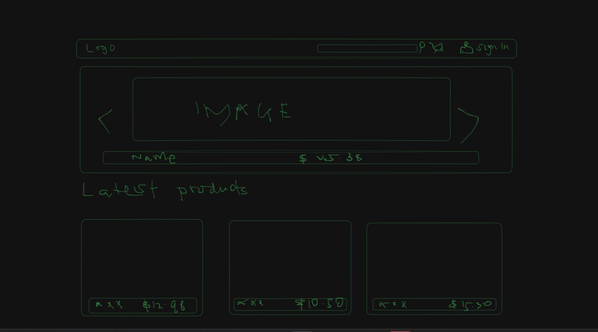
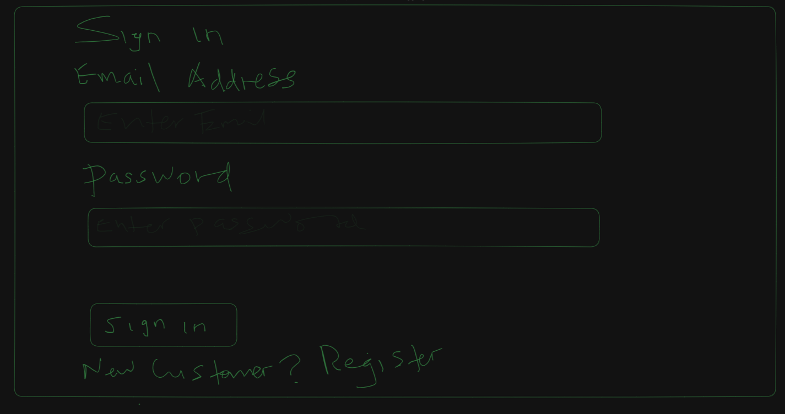
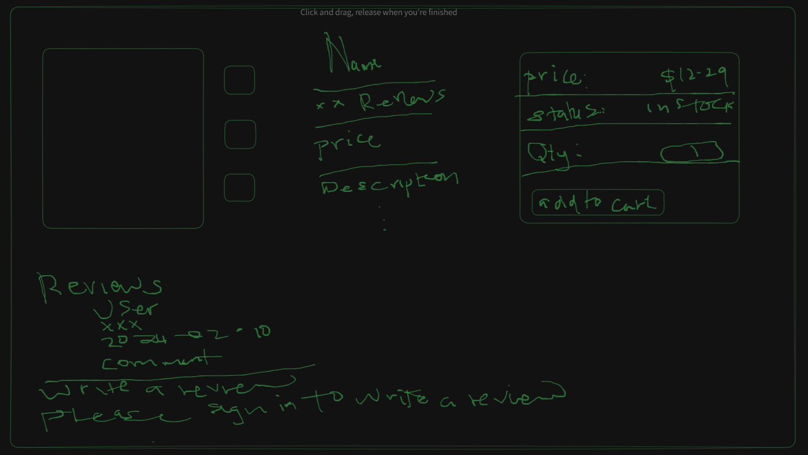
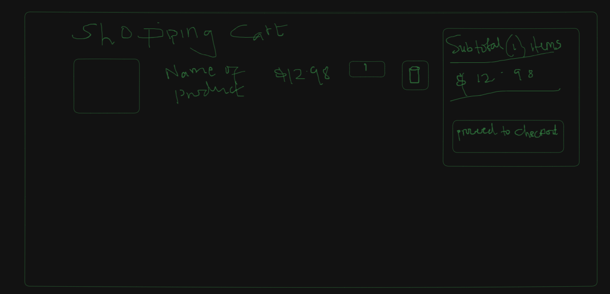
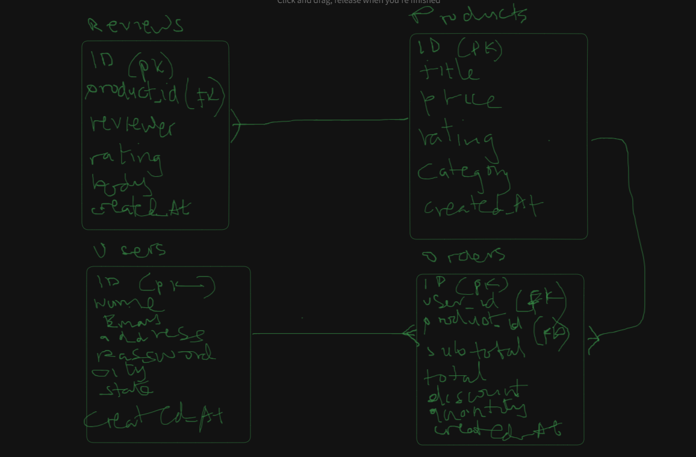

# Project Title

ElectroMart

## Overview

ElectroMart is an ecommerce website where you find all types of modern and latest gadgets like earphones, speakers, digital watches and mobile phones and more!

### Problem Space

In today's fast-paced world, finding the right electronics at the best prices can be a daunting task. Consumers often have to navigate through multiple websites, compare prices, read reviews, and ensure the authenticity of the products before finalizing a purchase. This process is time-consuming and can be overwhelming especially for those looking for specific electronics like mobile phones, headphones,earphones, speakers, and smart watches.
ElectroMart aims to simplify this process by providing a one-stop e-commerce platform focused exclusively on high-quality electronics. This platform will offer a curated selection of products, detailed reviews, and competitive pricing, ensuring that customers can make informed decisions quickly and confidently. By streamlining the shopping experience, ElectroMart will save consumers time and effort, making it easier to find and purchase the electronics they need.

### User Profile

Electronics enthusiasts:
-Exploring latest gadgets , to read detailed product information, and give reviews
-Searching for best deals and discounts,compare prices, and look for sales
-Purchasing electronics for personal use or gifts relying on user-friendly navigation and customer reviews
-Making quick purchases relying on curated selection and effecient checkout processes

### Features

As a user , I want to be able to create account to manage my cart items and checkout processes
As a user , I want to be able to login into my account to manage my cart items and checkout processes
As a user , I want to be able to browse through varieties of products to find the product I need
As a user , I want to be able to search for specific product using keyword to find the product I am looking for
As a user , I want to be able to view detailed product descriptions, specifications, and high- quality images to make informed decisions
As a user , I want to be able to read customer reviews and ratings to understand the quality and performance of the products
As a user , I want to be able to add items in the shopping cart for future purchase
As a user , I want to be able to have secure and streamlined checkout process to complete my purchases effeciently

## Implementation

### Tech Stack

Language: Javascript,
Runtime Envronment: Node.js
Frontend-build tool: Vite

Client Libraries:

- React
- React-router-dom
- Axios

Server Libraries

- Knex / Mongoose
- MySQL / MongoDB
- Express
- bcrypt for password hashing

### APIs

No external API will be used for this project for now

### Sitemap

- Home page (Featured Products)
- List products
- View product details
- View cart items
- Register
- Login

### Mockups

#### Home Page

#### Register Page

#### Login Page

#### Product Details Page

#### Cart Items Page

### Data

### Endpoints

List endpoints that your server will implement, including HTTP methods, parameters, and example responses.

## Roadmap

Scope your project as a sprint. Break down the tasks that will need to be completed and map out timeframes for implementation working back from the capstone due date.

---

## Future Implementations

Your project will be marked based on what you committed to in the above document. Here, you can list any additional features you may complete after the MVP of your application is built, or if you have extra time before the Capstone due date.
